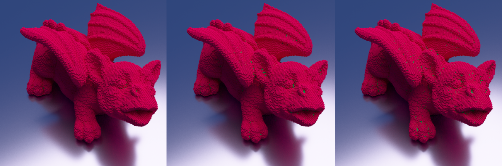

# Bubbles


This is my personal fluid solver, it is heavily based on the [fluid-engine-development](https://fluidenginedevelopment.org/) book by Doyub Kim, but with GPU support using CUDA - I don't however make any claims of it's performance or quality.

Currently it contain particle-based solvers for the following methods:
* SPH - Smoothed Particle Hydrodynamics
* PCI-SPH - Predict-Corrective SPH
* ESPIC - Eletrostatic PIC

This code was also used for my master's thesis and the code used for boundary routines is located under src/boundaries, and currently supports:
* Color Field [MCG03]
* Asymmetry [HLW+12]
* Sandim's Method [SCN+16, SPd20]
* Dilts [Dill00, HD07]
* Randles-Doring/Marrone - partially [MCLTG10]
* LNM - [OP22]

Building this code is straightforward, simply use the given CMakeLists and make the project. You will need a CUDA capable device (and nvcc installed) and Qhull (for Samdim's Method). If you don't want to build with Qhull, you can set `CONVEXHULL_QHULL` to `OFF` when building.
```bash
mkdir build
cd build
cmake -DCONVEXHULL_QHULL=OFF ..
make -j4
```
It will force Sandim's method to use an internal implementation of the Quick Hull algorithm, however the quality of boundary output will struggle. Several other helper routines for narrow-band extraction are also available under src/boundaries. The following is execution of these boundaries routines (Color Field, Asymmetry and Sandim).



Building Bubbles also builds the binary `bbtool` that provides utilities for manipulating the output simulation, export/import meshes and SDFs, visualizing simulations, creating rendering files and computing boundaries with different methods. For example it is possible to create meshes from Bubbles output using Marching Cubes with:
```bash
./bbtool surface -in <bubbles_output> -out mesh.obj
```
Boundary computation can be performed with the `boundary` command. Suppose we wish to compute the boundary of a simulation using Sandim's method, simply type:
```bash
./bbtool boundary -in <bubbles_output> -method sandim
```
It can also be used for generating files that can be used with [PBRT-v4](https://github.com/mmp/pbrt-v4) for rendering the particle systems that are exported, and also my own renderer [Lit](https://github.com/felpzOliveira/Lit) with:
```bash
./bbtool pbr -layered -in <bubbles_output> -out geometry.pbrt -renderer pbrt
```
There are several options in each tool in `bbtool` so I invite you to type the name of the command and inspect the brief description and flags available.
All images/simulations were made using spacing 0.02, but all commands have flags for changing kernel spacing and spacing scales.

Images used on the thesis and on this git were rendered with Lit, the file `fluid.lit` contains the scenes used in the thesis `Chapter 3` and images on this git page. Note however that this file uses directives such as:
```bash
...
import [ geometry.lit ]
...
geometry[ fluid.obj ]
...
```
These files must be generated from bubbles output, all simulations can be simply uncommented/commented in the `main` routine located in `bubbles.cpp`.
